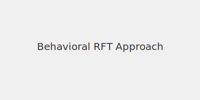

# Behavioral RFT Profile

We pursue a behavioral approach to the Abstraction and Reasoning Corpus (ARC) grounded in **Relational Frame Theory (RFT)**. RFT views language and cognition as patterns of learned relations, offering a framework for flexible transformation and generalization.

## Public Description
Our exploration maps ARC transformations through relational frames, aiming for adaptive, rule-based solutions that emerge from behavioral principles rather than brute-force search alone.

[S:DOC v1] profile_behavioral_rft pass
