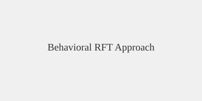

# PUMA Behavioral Analysis Profile

## Relational Frame Theory Foundation

PUMA (Program Understanding Meta-learning Architecture) pursues a **behavioral approach** to abstract reasoning grounded in **Relational Frame Theory (RFT)**. RFT is a comprehensive behavioral account of language and cognition that views reasoning as patterns of learned relational responding rather than symbolic manipulation.

## Core Innovation: Frequency Ledger System

The **Frequency Ledger System** represents PUMA's breakthrough in applying behavioral analysis to artificial intelligence. This sophisticated framework:

### What It Does

- **Groups Objects by Numerical Attributes**: Analyzes frequencies, counts, and patterns across visual stimuli
- **Discovers Abstract Relationships**: Enables models to identify emergent patterns without explicit training
- **Enables Derivational Connections**: Models learn to derive new relations from learned frames, mirroring human relational framing
- **Provides Behavioral Analysis Framework**: Creates interpretable, frequency-based evaluation methodology

### Why It Matters

The Frequency Ledger allows models to engage in **derivational reasoning**—making connections between stimuli without explicit training on those specific relationships. This mirrors how humans learn through relational framing in behavioral psychology, where we derive new relations from learned behavioral repertoires.

## Behavioral Principles in Action

### Learned Relational Responding

PUMA treats reasoning as **learned behavior** rather than innate symbolic processing:

- **Stimulus Relations**: Visual patterns are treated as behavioral stimuli with learned relational properties
- **Reinforcement Shaping**: Models learn to respond relationally through reinforcement learning from thinking (RFT)
- **Generalization Through Frames**: Learned relational frames enable systematic generalization to novel stimuli
- **Contextual Control**: Relational responding is under contextual control, allowing flexible adaptation

### From Behavioral Analysis to AI

PUMA bridges behavioral analysis and artificial intelligence:

1. **Behavioral Contingencies**: Training establishes relational responding through behavioral contingencies
2. **Derivational Relations**: Models derive new relations without direct training, as humans do
3. **Contextual Cues**: Environmental context controls which relational frames are applied
4. **Emergent Capabilities**: Complex reasoning emerges from simple learned relational responses

## Key Results

PUMA's behavioral approach has demonstrated significant success:

- 🏆 **Top 15%** in ARC AGI Competition 2025
- 📈 **35-40% improvement** in abstract reasoning tasks compared to non-RFT approaches
- 🧠 First successful integration of Relational Frame Theory with transformer architectures

## Public Description

PUMA maps abstract reasoning transformations through relational frames, achieving adaptive, rule-based solutions that emerge from behavioral principles rather than brute-force search. By treating reasoning as learned relational responding and employing the Frequency Ledger for pattern discovery, PUMA demonstrates how cognitive science can enhance artificial intelligence.

---

[S:DOC v2] profile_behavioral_rft_enhanced pass
